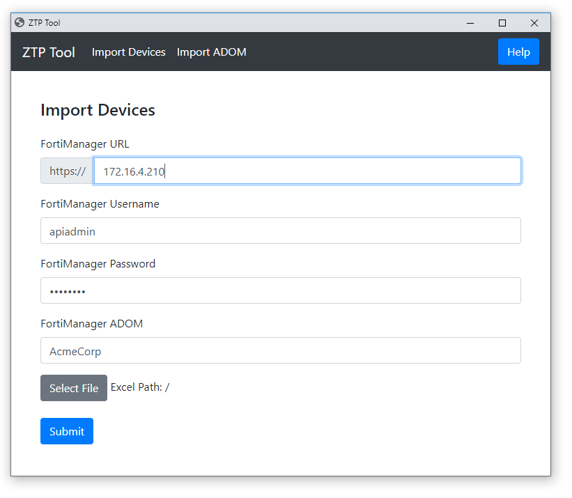

## Fortinet Secure SD-WAN Zero Touch Provisioning (ZTP) Tool
 
ZTP Tool is a small GUI application to assist with setting up Fortinet FortiManager for Zero Touch Provisioning (ZTP) of SD-WAN deployments. ZTP Tool has two main functions:

1) Import devices from an Excel file (Model Device with Meta Data, CLI Templates, SD-WAN templates and Policy Packages applied)
2) Import ADOM from JSON file (with CLI Templates, SD-WAN Templates and Policy packages in place)

## Getting Started with demo_example

> Included examples only works for FortiManager 6.2.1 and 6.2.2

Extract the files from the .zip archive somewhere on your computer.

**Note:** Chrome must be installed the computer.

Create an user on FortiManager version 6.2.1+ with `<rpc-permit read-write>` permissions set with ADOM mode enabled. 

Open ztptool.exe.

Go to the Import ADOM page and fill in the form and select the demo_example.json file.

This will setup your new ADOM with CLI Templates, SDWAN Templates, Policy Packages and Objects. 

Now go to the Import Devices Page. 

Fill in the form and select the demo_example.xlsx file. 

This will populate your FortiManager ADOM with prebuild model devices. 

## Workflow

Before Device Setup
1) Load Excel file
2) Login to FortiManager
3) Run validity check on FortiManager and the Excel File
4) Create any meta fields which do not already exist

Per Device Setup
1) Create Model Device
2) Assign meta fields to device
3) Assign initial CLI Template/Group to device
4) Run Device Install to apply CLI Template
5) Unassign Initial CLI Template/Group
6) Assign Dynamic SD-WAN Template and Policy Package Objects
7) Assign SD-WAN Template
8) Assign Policy Package
9) Assign Post CLI Template/Group
10) Install Policy Package and Device Settings